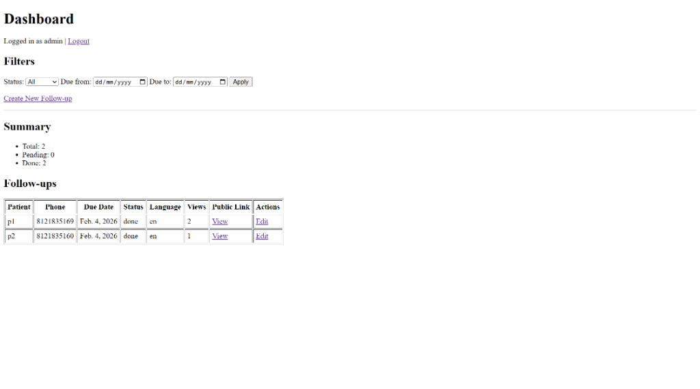
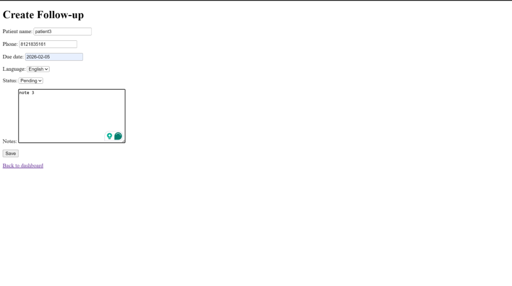
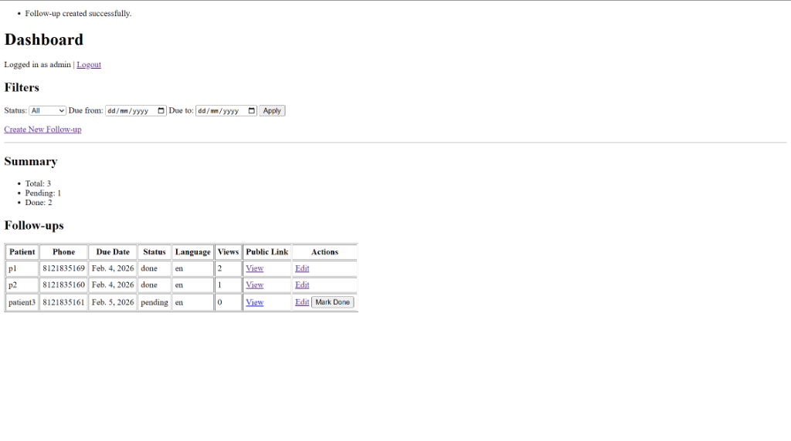
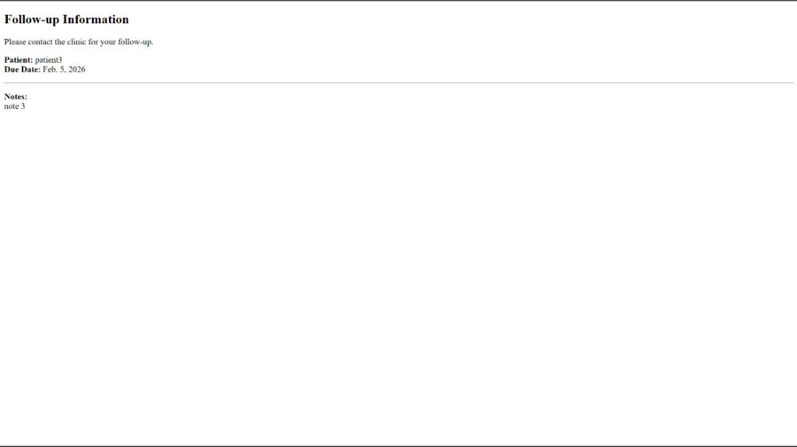
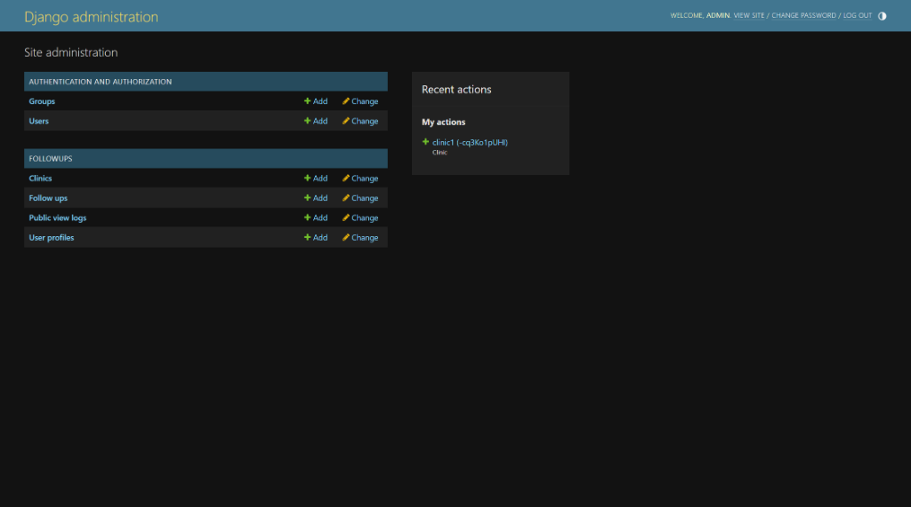
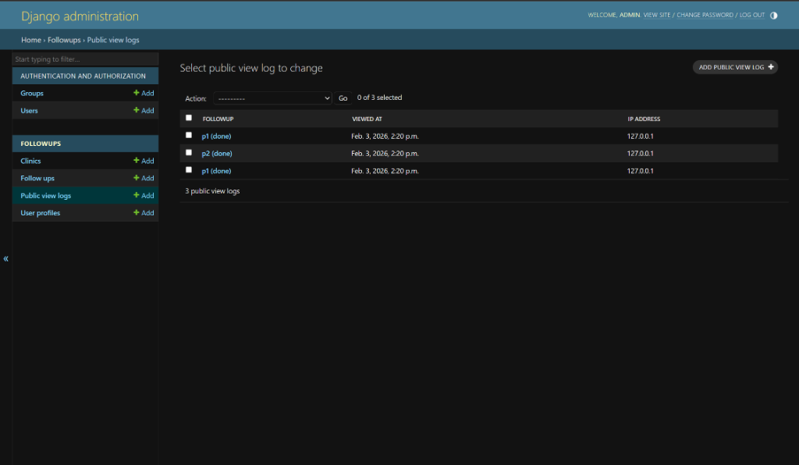

# Clinic Follow-up Tracker (Lite)

A lightweight Django application to manage clinic follow-ups with authentication, clinic-level access control, public follow-up pages, and CSV import support.

This project was built as a time-boxed assignment focusing on correctness, clarity, and production-ready Django patterns.

---

## Tech Stack

- Python 3.10+
- Django 4.2+
- MySQL (active)
- No DRF, Celery, or external UI frameworks

---

## Setup Instructions

### 1. Create and activate a virtual environment

```bash
python -m venv venv
source venv/bin/activate   # Windows: venv\Scripts\activate
```

### 2. Install dependencies

```bash
pip install -r requirements.txt
```

### 3. Apply database migrations

```bash
python manage.py migrate
```

### 4. Create a superuser

```bash
python manage.py createsuperuser
```

### 5. Run the development server

```bash
python manage.py runserver
```

The application will be available at: http://127.0.0.1:8000/

---

## Creating Clinic and UserProfile

1. Visit the Django admin panel: http://127.0.0.1:8000/admin/
2. Create a **Clinic**
3. Create or edit a **User**
4. Create or update the corresponding **UserProfile**
5. Assign the user to the clinic

Users can only see and manage follow-ups belonging to their assigned clinic.

> Clinic and UserProfile management is intentionally handled via Django Admin to keep the core application logic simple and explicit.

---

## Running Tests

The project includes the required 5 tests covering:

- Unique token generation
- Authentication enforcement
- Clinic-level access control
- Public view logging

Run all tests using:

```bash
python manage.py test
```

---

## Import Follow-ups from CSV

A custom management command is provided to import follow-ups from a CSV file.

### Command

```bash
python manage.py import_followups --csv sample.csv --username <username>
```

### Behavior

- Safely parses the CSV
- Validates required fields
- Validates phone number format (10-digit local or 12-digit with country code)
- Skips invalid rows without stopping execution
- Prints a summary of created vs skipped rows

A sample CSV file (`sample.csv`) is included in the repository.

---

## Public Follow-up Page

Each follow-up has a public page accessible without login:

```
/p/<public_token>/
```

### Features

- Language-based instruction message (English / Hindi)
- Each visit creates a `PublicViewLog`
- View counts are visible on the dashboard

---

## Database Configuration

**MySQL** is used as the primary database.

The database configuration is in `settings.py`:

```python
DATABASES = {
    "default": {
        "ENGINE": "django.db.backends.mysql",
        "NAME": "clinic_tracker",
        "USER": "root",
        "PASSWORD": "your_password",
        "HOST": "localhost",
        "PORT": "3306",
    }
}
```

### Setup

1. Create the database in MySQL:
   ```sql
   CREATE DATABASE clinic_tracker;
   ```

2. Update the password in `settings.py`

3. Run migrations:
   ```bash
   python manage.py migrate
   ```

---

## Screenshots

### Dashboard


### Create Follow-up Form


### Dashboard with Success Message


### Login Page


### Public Follow-up Page


### Django Admin Panel


### Public View Logs (View Log Evidence)


---

## Demo Video

A screen recording demonstrating the full application flow is included:

[demo.mp4](demo.mp4)


